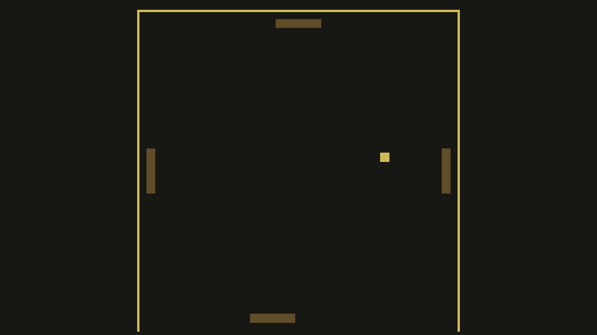

# Keep Pong Going

Author: Xinyi Sun

Design: This is a multiplayer game that allows up to 4 players to play an unconventional pong game where their collective goal is to keep pong going as long as possible. Random openings might show up on the four sides. Players should aim to keep pong within range. This was one of my ideas for game0 which was not possible back at the time since only single-player was allowed.

Networking: The overall game state (i.e. whether the ball has "escaped", the position of the ball) is maintained by the server. The server is also responsible for detecting collisions. The server then sends ball's position, each active player's position, whether the ball has escaped to each active player. Each client is only responsible for updating their own paddle's position, which is then sent to server.

Screen Shot:

How To Play:

Use your mouse to control your paddle.

Sources: This game stems from the pong game so a significant portion of the game code including object collision and 2D drawing comes from the base code of game0 F20 as well as my new code for game0. Other than that, wrong\_ball.wav is a track I created for game3.

This game was built with [NEST](NEST.md).

